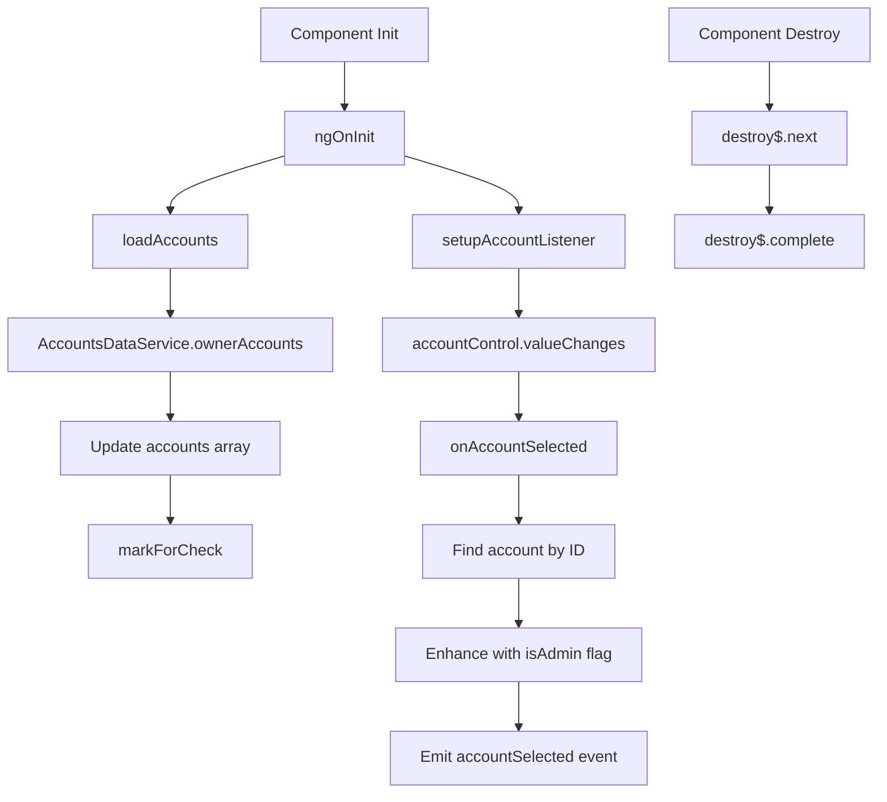

# Account Selector Component - Technical Details

## Component Architecture Deep Dive

### Class Structure Analysis

```typescript
@Component({
  selector: 'app-account-selector',
  templateUrl: './account-selector.component.html',
  styleUrls: ['./account-selector.component.scss'],
  standalone: true,
  imports: [
    CommonModule,
    TranslateModule,
    MatIconModule,
    MatFormFieldModule,
    MatSelectModule,
    ReactiveFormsModule
  ],
  changeDetection: ChangeDetectionStrategy.OnPush
})
export class AccountSelectorComponent implements OnInit, OnDestroy {
  // Input properties
  @Input() helperText: string = 'common.selectAccountFirst';
  
  // Output events
  @Output() accountSelected = new EventEmitter<Account>();
  
  // Public properties
  public accountControl = new FormControl<string | null>(null);
  public accounts: Account[] = [];
  public selectedAccountId: string | null = null;
  
  // Private properties
  private destroy$ = new Subject<void>();
}
```

### Data Flow Architecture



## State Management

### Form Control Integration

```typescript
public accountControl = new FormControl<string | null>(null);

private setupAccountListener(): void {
  this.accountControl.valueChanges
    .pipe(takeUntil(this.destroy$))
    .subscribe(accountId => {
      if (!accountId) return;
      this.onAccountSelected(accountId);
    });
}
```

### Account Data Management

```typescript
public accounts: Account[] = [];
public selectedAccountId: string | null = null;

private loadAccounts(): void {
  this.accountsService.ownerAccounts()
    .pipe(takeUntil(this.destroy$))
    .subscribe(accounts => {
      this.accounts = accounts;
      this.cdr.markForCheck();
    });
}
```

### Account Enhancement Logic

```typescript
private onAccountSelected(accountId: string): void {
  this.selectedAccountId = accountId;
  const selectedAccount = this.accounts.find(account => account.id === accountId);
  if (selectedAccount) {
    // Dynamic property addition for admin detection
    selectedAccount['isAdmin'] = selectedAccount.name === 'admin';
    this.accountSelected.emit(selectedAccount);
  }
}
```

## Template Structure Analysis

### DOM Structure
```html
<div class="account-selector mb-3 mx-3">
  <!-- Material Form Field Container -->
  <mat-form-field appearance="outline" class="w-100">
    <mat-label>{{ 'domains.ownerAccount' | translate }}</mat-label>
    
    <!-- Material Select Dropdown -->
    <mat-select [formControl]="accountControl">
      <mat-option *ngFor="let account of accounts" [value]="account.id">
        {{ getAccountDisplayName(account) }}
      </mat-option>
    </mat-select>
  </mat-form-field>

  <!-- Helper Text with Icon -->
  <div class="helper-text" *ngIf="!selectedAccountId">
    <mat-icon color="primary">info</mat-icon>
    {{ helperText | translate }}
  </div>
</div>
```

### Template Logic
- **Conditional Helper**: Helper text only shows when no account is selected
- **Dynamic Options**: Account options generated from loaded accounts array
- **Translation Support**: All text elements use Angular i18n pipes
- **Reactive Forms**: Integrated with FormControl for two-way binding

## Styling System

### CSS Architecture
```scss
.account-selector {
  // Container styling
  background: #fff;
  border: 1px solid var(--ag-border-color);
  border-radius: 4px;
  box-shadow: 0 1px 4px rgba(0, 0, 0, 0.1);
  display: flex;
  flex-direction: column;
  max-width: 600px;
  padding: 24px;
  position: relative;
  overflow: hidden;

  // Helper text styling
  .helper-text {
    display: flex;
    align-items: center;
    gap: 8px;
    color: var(--ag-secondary-color, #666);
    font-size: 14px;

    mat-icon {
      font-size: 18px;
      width: 18px;
      height: 18px;
    }
  }

  // Form field spacing
  mat-form-field {
    margin-bottom: 8px;
  }
}
```

### Responsive Design Implementation
```scss
@media screen and (max-width: 768px) {
  .account-selector {
    max-width: 100%;
    margin: 0 16px;
    padding: 16px;
  }
}
```

### CSS Custom Properties Integration
- Uses `--ag-border-color` for consistent theming
- Uses `--ag-secondary-color` for helper text
- Fallback values for browsers without custom property support

## Performance Optimization

### Change Detection Strategy
```typescript
@Component({
  changeDetection: ChangeDetectionStrategy.OnPush
})
export class AccountSelectorComponent {
  constructor(private cdr: ChangeDetectorRef) {}

  private loadAccounts(): void {
    this.accountsService.ownerAccounts()
      .pipe(takeUntil(this.destroy$))
      .subscribe(accounts => {
        this.accounts = accounts;
        this.cdr.markForCheck(); // Manual change detection trigger
      });
  }
}
```

### Memory Management
```typescript
private destroy$ = new Subject<void>();

ngOnDestroy(): void {
  this.destroy$.next();    // Signal completion to all subscriptions
  this.destroy$.complete(); // Complete the subject
}

// Usage in subscriptions
.pipe(takeUntil(this.destroy$))
```

### Efficient Account Display
```typescript
public getAccountDisplayName(account: Account): string {
  // Fallback chain for robust display name resolution
  return account.name || account.email || account.id;
}
```

## Service Integration

### AccountsDataService Dependency
```typescript
constructor(
  private accountsService: AccountsDataService,
  private cdr: ChangeDetectorRef
) {}

private loadAccounts(): void {
  this.accountsService.ownerAccounts()
    .pipe(takeUntil(this.destroy$))
    .subscribe(accounts => {
      this.accounts = accounts;
      this.cdr.markForCheck();
    });
}
```

### Service Interface
```typescript
interface AccountsDataService {
  ownerAccounts(): Observable<Account[]>;
}

interface Account {
  id: string;
  name?: string;
  email?: string;
  // Additional properties...
}
```

## Event System

### Output Event Structure
```typescript
@Output() accountSelected = new EventEmitter<Account>();

// Enhanced account object emitted
interface EnhancedAccount extends Account {
  isAdmin?: boolean; // Dynamically added property
}
```

### Event Flow
1. User selects account from dropdown
2. FormControl emits value change
3. Component finds account object by ID
4. Account object enhanced with `isAdmin` property
5. Enhanced account emitted via `accountSelected` event

## Error Handling Strategy

### Service Error Handling
```typescript
private loadAccounts(): void {
  this.accountsService.ownerAccounts()
    .pipe(
      takeUntil(this.destroy$),
      catchError(error => {
        console.error('Failed to load accounts:', error);
        // Return empty array to prevent component crash
        return of([]);
      })
    )
    .subscribe(accounts => {
      this.accounts = accounts;
      this.cdr.markForCheck();
    });
}
```

### Defensive Programming
```typescript
private onAccountSelected(accountId: string): void {
  if (!accountId) return; // Guard clause for null/undefined
  
  this.selectedAccountId = accountId;
  const selectedAccount = this.accounts.find(account => account.id === accountId);
  
  if (selectedAccount) { // Null check before processing
    selectedAccount['isAdmin'] = selectedAccount.name === 'admin';
    this.accountSelected.emit(selectedAccount);
  }
}

public getAccountDisplayName(account: Account): string {
  // Multiple fallbacks for robust display
  return account.name || account.email || account.id;
}
```

## Testing Considerations

### Unit Testing Setup
```typescript
describe('AccountSelectorComponent', () => {
  let component: AccountSelectorComponent;
  let fixture: ComponentFixture<AccountSelectorComponent>;
  let mockAccountsService: jasmine.SpyObj<AccountsDataService>;

  beforeEach(() => {
    const spy = jasmine.createSpyObj('AccountsDataService', ['ownerAccounts']);
    
    TestBed.configureTestingModule({
      imports: [AccountSelectorComponent],
      providers: [
        { provide: AccountsDataService, useValue: spy }
      ]
    });

    fixture = TestBed.createComponent(AccountSelectorComponent);
    component = fixture.componentInstance;
    mockAccountsService = TestBed.inject(AccountsDataService) as jasmine.SpyObj<AccountsDataService>;
  });
});
```

### Key Test Cases
```typescript
it('should load accounts on init', () => {
  const mockAccounts = [
    { id: '1', name: 'Account 1' },
    { id: '2', name: 'Account 2' }
  ];
  mockAccountsService.ownerAccounts.and.returnValue(of(mockAccounts));

  component.ngOnInit();

  expect(mockAccountsService.ownerAccounts).toHaveBeenCalled();
  expect(component.accounts).toEqual(mockAccounts);
});

it('should emit account selection with isAdmin flag', () => {
  spyOn(component.accountSelected, 'emit');
  const mockAccount = { id: '1', name: 'admin' };
  component.accounts = [mockAccount];

  component.accountControl.setValue('1');

  expect(component.accountSelected.emit).toHaveBeenCalledWith(
    jasmine.objectContaining({ isAdmin: true })
  );
});

it('should display helper text when no account selected', () => {
  component.selectedAccountId = null;
  fixture.detectChanges();

  const helperText = fixture.debugElement.query(By.css('.helper-text'));
  expect(helperText).toBeTruthy();
});
```

## Accessibility Implementation

### Material Design Compliance
- Uses Material Form Field for proper labeling
- Implements ARIA attributes through Material components
- Supports keyboard navigation via Material Select
- Provides clear visual feedback for selection states

### Screen Reader Support
```html
<mat-label>{{ 'domains.ownerAccount' | translate }}</mat-label>
<mat-select [formControl]="accountControl">
  <mat-option *ngFor="let account of accounts" [value]="account.id">
    {{ getAccountDisplayName(account) }}
  </mat-option>
</mat-select>
```

### Focus Management
- Material Select handles focus management automatically
- Visual indicators for focused states
- Keyboard navigation support (Arrow keys, Enter, Escape)

## Internationalization (i18n)

### Translation Integration
```typescript
// Component uses translation keys
helperText: string = 'common.selectAccountFirst';
```

```html
<!-- Template uses translation pipe -->
<mat-label>{{ 'domains.ownerAccount' | translate }}</mat-label>
{{ helperText | translate }}
```

### Translation Keys
- `domains.ownerAccount` - Field label
- `common.selectAccountFirst` - Default helper text
- Custom helper text keys passed via `helperText` input

## Security Considerations

### Admin Account Detection
```typescript
selectedAccount['isAdmin'] = selectedAccount.name === 'admin';
```

### Data Validation
- Account ID validation before processing
- Safe property access with fallbacks
- Input sanitization through Angular's built-in protections

## Browser Compatibility

### Supported Features
- CSS Custom Properties (with fallbacks)
- Angular Material components
- ES6+ features (transpiled by Angular CLI)
- Modern browser APIs

### Fallback Strategies
```scss
color: var(--ag-secondary-color, #666); // CSS custom property with fallback
```

## Migration and Upgrade Path

### Standalone Component Migration
The component is already standalone, making it easy to migrate between different module systems.

### Breaking Changes Handling
- Input property changes would require parent component updates
- Output event structure changes would need consumer updates
- Service interface changes would require service layer updates

### Version Compatibility
- Angular 12+ for standalone components
- Material Design 12+ for form components
- TypeScript 4.0+ for strict typing 