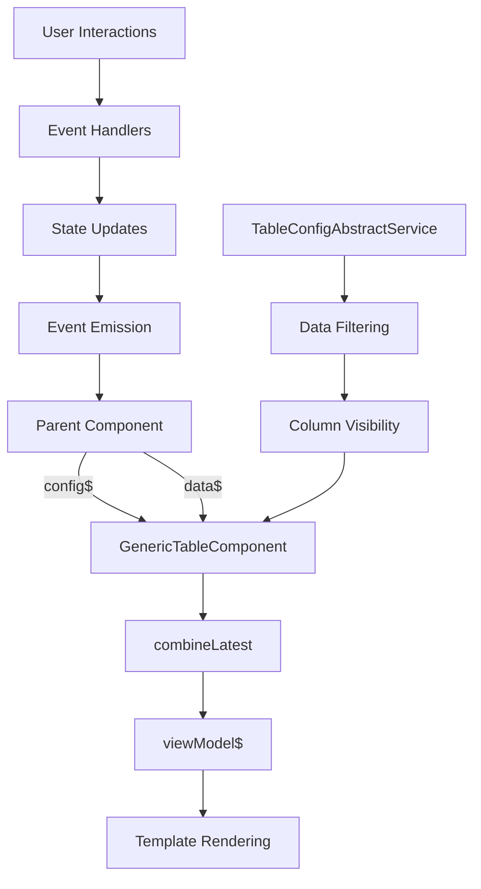

# Generic Table Component - Technical Details

## Component Architecture

### Class Structure Analysis

```typescript
class GenericTableComponent implements OnChanges {
  // Content Projection
  @ContentChild('[custom-toolbar]', {read: TemplateRef})
  public customToolbarTpl?: TemplateRef<any>;

  // Input Properties
  @Input() config$!: Observable<TableConfig>;     // Configuration stream
  @Input() data$!: Observable<any[]>;            // Data stream  
  @Input() menu!: TemplateRef<any>;              // Action menu template
  @Input() isRowClickable = false;               // Row interaction flag

  // Output Events
  @Output() selectedItemsChange = new EventEmitter<any[]>();
  @Output() onRowClickEvent = new EventEmitter<any>();
  @Output() toggleAction = new EventEmitter<any>();
  @Output() pageChange = new EventEmitter<PageChangeEvent>();
  @Output() sortChange = new EventEmitter<SortChangeEvent>();

  // State Management
  public viewModel$!: Observable<ViewModel>;      // Combined config + data
  public currentPage = 0;                        // Pagination state
  public pageSize = 10;                          // Page size
  public totalPages = 0;                         // Total pages
  public selectedItems = new Set<any>();         // Selection state
}
```

### Data Flow Architecture



## State Management Deep Dive

### Selection Management
```typescript
// Efficient selection using Set for O(1) operations
public selectedItems = new Set<any>();

// Toggle individual item
public toggleItemSelection(item: any, event: any): void {
  if (event.target.checked) {
    this.selectedItems.add(item);      // O(1) add
  } else {
    this.selectedItems.delete(item);   // O(1) delete
  }
  this.selectedItemsChange.emit(Array.from(this.selectedItems)); // Convert to array
}

// Check if item is selected
public isSelected(item: any): boolean {
  return this.selectedItems.has(item); // O(1) lookup
}

// Toggle all items
public toggleAll(event: any): void {
  this.data$.pipe(take(1)).subscribe(data => {
    if (event.target.checked) {
      data.forEach(item => this.selectedItems.add(item));
    } else {
      this.selectedItems.clear();
    }
    this.selectedItemsChange.emit(Array.from(this.selectedItems));
  });
}
```

### Pagination State Management
```typescript
// Pagination properties
public currentPage = 0;
public pageSize = 10;
public totalPages = 0;

// Page change handler with server-side support
public changePage(newPage: number, isServerSide?: boolean): void {
  this.currentPage = newPage;
  this.pageChange.emit({
    page: this.currentPage,
    size: this.pageSize,
    isServerSide
  });
}

// Configuration update for total pages
private updatePagination(totalPages: number): void {
  const currentConfig = this.tableConfig$.value;
  this.tableConfig$.next({
    ...currentConfig,
    pagination: {
      ...currentConfig.pagination,
      totalPages
    }
  });
}
```

### Sorting State Management
```typescript
// Column sorting with direction management
public onSortColumn(column: any): void {
  if (!column.sortable) return;
  
  this.config$.pipe(take(1)).subscribe(cfg => {
    // Reset other columns
    cfg.columns.forEach(col => {
      if (col !== column) col.sortDirection = null;
    });
    
    // Toggle current column
    column.sortDirection = column.sortDirection === 'asc' ? 'desc' : 'asc';
    
    // Emit sort event
    this.sortChange.emit({
      column: column.key,
      direction: column.sortDirection
    });
  });
}

// Initialize sort directions
private setSortDirection(columns: TableColumnConfig[]): void {
  columns.forEach(column => {
    if (column?.sortable && !column.sortDirection) {
      column.sortDirection = 'asc';
    }
  });
}
```

## Template Structure Analysis

### DOM Structure Hierarchy
```html
<!-- Root Container -->
<div class="ag-grid-wrapper">
  
  <!-- Optional Custom Toolbar -->
  <div class="ag-header-toolbar" *ngIf="customToolbarTpl">
    <div class="ag-header-buttons">
      <ng-content select="[custom-toolbar]"></ng-content>
    </div>
  </div>

  <!-- Table Container -->
  <div class="ag-grid-table-container">
    <table class="ag-grid-table">
      
      <!-- Column Group Definitions -->
      <colgroup>
        <col *ngIf="showCheckboxes" style="width:3rem">
        <col *ngFor="let col of columns" 
             [style.width]="col.width" 
             [style.min-width]="col.minWidth">
        <col *ngIf="showActions" style="width:45px">
      </colgroup>

      <!-- Table Header -->
      <thead class="ag-header">
        <tr class="ag-header-row">
          <th class="ag-header-cell" *ngFor="let col of columns">
            <!-- Header Content -->
          </th>
        </tr>
      </thead>

      <!-- Table Body -->
      <tbody class="ag-body">
        <tr class="ag-row" *ngFor="let item of data; trackBy: trackById">
          <td class="ag-cell" *ngFor="let col of columns">
            <!-- Cell Content -->
          </td>
        </tr>
      </tbody>
    </table>
  </div>

  <!-- Pagination Panel -->
  <div class="ag-pagination-panel" *ngIf="pagination.enabled">
    <!-- Pagination Controls -->
  </div>
</div>
```

### Cell Template Resolution
```typescript
// Template type resolution in component
<ng-container [ngSwitch]="col.templateType">
  <ng-container *ngSwitchCase="'text'">
    {{ item | displayValueByKey: col.key }}
  </ng-container>
  <ng-container *ngSwitchCase="'date'">
    {{ item[col.key] | date: col.dateFormat }}
  </ng-container>
  <ng-container *ngSwitchCase="'time'">
    {{ item[col.key] | formatTime }}
  </ng-container>
  <ng-container *ngSwitchCase="'custom'">
    <ng-container *ngTemplateOutlet="col.customTemplate(); context:{ context: item }">
    </ng-container>
  </ng-container>
  <ng-container *ngSwitchDefault>
    {{ item[col.key] }}
  </ng-container>
</ng-container>
```

## Performance Optimization Strategies

### Change Detection Optimization
```typescript
@Component({
  selector: 'generic-table',
  templateUrl: './generic-table.component.html',
  styleUrls: ['./generic-table.component.scss'],
  changeDetection: ChangeDetectionStrategy.OnPush  // OnPush strategy
})
export class GenericTableComponent implements OnChanges {
  
  // TrackBy function for efficient list rendering
  public trackById(_: number, item: any): any {
    return item.id ?? _;  // Use item ID or index as fallback
  }

  // Reactive patterns prevent unnecessary updates
  public viewModel$!: Observable<{ config: TableConfig; data: any[] }>;

  private createViewModel(): void {
    this.viewModel$ = combineLatest([this.config$, this.data$]).pipe(
      map(([config, data]) => {
        this.setSortDirection(config.columns);
        
        if (config.pagination?.totalPages != null) {
          this.totalPages = config.pagination.totalPages;
        }
        
        return { config, data };
      })
    );
  }
}
```

### Memory Management
```typescript
// Efficient data structures
public selectedItems = new Set<any>();  // O(1) operations vs Array O(n)

// Unsubscription pattern (if needed for subscriptions)
private destroy$ = new Subject<void>();

ngOnDestroy(): void {
  this.destroy$.next();
  this.destroy$.complete();
}

// Use takeUntil pattern for subscriptions
someObservable$.pipe(
  takeUntil(this.destroy$)
).subscribe(...);
```

## CSS Architecture & Styling System

### CSS Custom Properties Structure
```scss
:root {
  // Grid dimensions
  --ag-header-height: 42px;
  --ag-row-height: 36px;
  --ag-list-item-height: 28px;

  // Colors - Header
  --ag-header-foreground-color: rgba(0, 0, 0, 0.87);
  --ag-header-background-color: #f8f8f8;
  --ag-header-cell-hover-background-color: #e6e6e6;

  // Colors - Rows
  --ag-row-hover-color: rgba(var(--os-color-primary-rgb), 0.05);
  --ag-row-border-color: #e2e2e2;
  --ag-odd-row-background-color: #f9f9f9;
  --ag-even-row-background-color: #ffffff;
  --ag-selected-row-background-color: rgba(var(--os-color-primary-rgb), 0.1);

  // Colors - Cells
  --ag-cell-horizontal-border: solid 1px #e2e2e2;
  --ag-cell-horizontal-padding: 12px;
  --ag-cell-vertical-padding: 8px;

  // Pagination
  --ag-pagination-panel-background-color: #f8f8f8;
}
```

### Component Styling Classes
```scss
.ag-grid-wrapper {
  border: 1px solid var(--ag-row-border-color);
  border-radius: 4px;
  overflow: hidden;

  &.clickable .ag-row {
    cursor: pointer;
    
    &:hover {
      background-color: var(--ag-row-hover-color);
    }
  }
}

.ag-grid-table {
  width: 100%;
  border-collapse: collapse;
  
  .ag-header-cell {
    height: var(--ag-header-height);
    background-color: var(--ag-header-background-color);
    border-bottom: var(--ag-cell-horizontal-border);
    
    &.sortable {
      cursor: pointer;
      user-select: none;
      
      &:hover {
        background-color: var(--ag-header-cell-hover-background-color);
      }
    }
  }

  .ag-row {
    height: var(--ag-row-height);
    
    &.ag-row-even {
      background-color: var(--ag-even-row-background-color);
    }
    
    &.ag-row-odd {
      background-color: var(--ag-odd-row-background-color);
    }
    
    &.selected {
      background-color: var(--ag-selected-row-background-color);
    }
  }

  .ag-cell {
    padding: var(--ag-cell-vertical-padding) var(--ag-cell-horizontal-padding);
    border-bottom: var(--ag-cell-horizontal-border);
    vertical-align: middle;
  }
}
```

## Integration Patterns

### Service Integration Pattern
```typescript
// Abstract service extension pattern
export class MyTableComponent extends TableConfigAbstractService<MyDataType> {
  public tableConfigSubject = new BehaviorSubject<TableConfig>({
    // Configuration
  });

  constructor(private myService: MyService) {
    super();
  }

  // Inherit filtering, pagination, and column management
  // Override specific methods as needed
  
  protected loadData(): void {
    this.myService.getData().subscribe(data => {
      this.originalDataSubject.next(data);
    });
  }
}
```

### Event Handling Patterns
```typescript
// Event aggregation pattern
export class TableEventsService {
  private sortEvents$ = new Subject<SortEvent>();
  private paginationEvents$ = new Subject<PageEvent>();
  private selectionEvents$ = new Subject<SelectionEvent>();

  // Aggregate all table events
  public tableEvents$ = merge(
    this.sortEvents$.pipe(map(e => ({ type: 'sort', payload: e }))),
    this.paginationEvents$.pipe(map(e => ({ type: 'page', payload: e }))),
    this.selectionEvents$.pipe(map(e => ({ type: 'select', payload: e })))
  );

  handleTableEvent(event: TableEvent): void {
    switch (event.type) {
      case 'sort':
        this.handleSort(event.payload);
        break;
      case 'page':
        this.handlePagination(event.payload);
        break;
      case 'select':
        this.handleSelection(event.payload);
        break;
    }
  }
}
```

## Testing Strategies

### Component Testing Setup
```typescript
describe('GenericTableComponent', () => {
  let component: GenericTableComponent;
  let fixture: ComponentFixture<GenericTableComponent>;

  beforeEach(async () => {
    await TestBed.configureTestingModule({
      declarations: [GenericTableComponent],
      imports: [
        CommonModule,
        TranslateModule.forRoot(),
        NoDataModule,
        FormatTimeModule
      ]
    }).compileComponents();

    fixture = TestBed.createComponent(GenericTableComponent);
    component = fixture.componentInstance;
  });

  it('should create', () => {
    expect(component).toBeTruthy();
  });

  it('should handle selection correctly', () => {
    const testItem = { id: 1, name: 'Test' };
    const mockEvent = { target: { checked: true } };
    
    component.toggleItemSelection(testItem, mockEvent);
    
    expect(component.isSelected(testItem)).toBeTruthy();
    expect(component.selectedItems.size).toBe(1);
  });

  it('should emit sort events', () => {
    spyOn(component.sortChange, 'emit');
    const testColumn = { key: 'name', sortable: true, sortDirection: 'asc' };
    
    component.config$ = of({
      columns: [testColumn]
    } as TableConfig);
    
    component.onSortColumn(testColumn);
    
    expect(component.sortChange.emit).toHaveBeenCalledWith({
      column: 'name',
      direction: 'desc'
    });
  });
});
```

### Integration Testing
```typescript
describe('GenericTable Integration', () => {
  let testComponent: TestHostComponent;
  let fixture: ComponentFixture<TestHostComponent>;

  @Component({
    template: `
      <generic-table
        [config$]="tableConfig$"
        [data$]="tableData$"
        (sortChange)="onSort($event)"
        (pageChange)="onPageChange($event)">
      </generic-table>
    `
  })
  class TestHostComponent {
    tableConfig$ = new BehaviorSubject<TableConfig>(mockTableConfig);
    tableData$ = new BehaviorSubject<any[]>(mockData);
    
    onSort = jasmine.createSpy('onSort');
    onPageChange = jasmine.createSpy('onPageChange');
  }

  // Integration tests...
});
```

## Migration and Upgrade Guidelines

### Version Compatibility
- Angular 12+ required for proper Observable handling
- CoreUI 4.x for styling components
- RxJS 7+ for reactive patterns

### Breaking Changes Handling
```typescript
// Migration helper for config changes
export function migrateTableConfig(oldConfig: any): TableConfig {
  return {
    ...oldConfig,
    columns: oldConfig.columns.map(col => ({
      ...col,
      // Handle deprecated properties
      template: col.customTemplate || col.template,
      // Add new required properties
      sortDirection: col.sortDirection || null
    }))
  };
}
```

### Performance Monitoring
```typescript
// Performance monitoring decorator
export function MonitorTablePerformance(target: any, propertyName: string, descriptor: PropertyDescriptor) {
  const method = descriptor.value;
  
  descriptor.value = function (...args: any[]) {
    const start = performance.now();
    const result = method.apply(this, args);
    const end = performance.now();
    
    console.log(`${propertyName} took ${end - start} milliseconds`);
    return result;
  };
  
  return descriptor;
}

// Usage
export class GenericTableComponent {
  @MonitorTablePerformance
  public onSortColumn(column: any): void {
    // Method implementation
  }
}
``` 